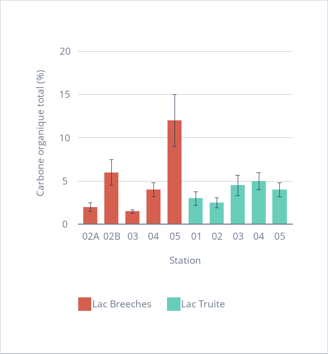
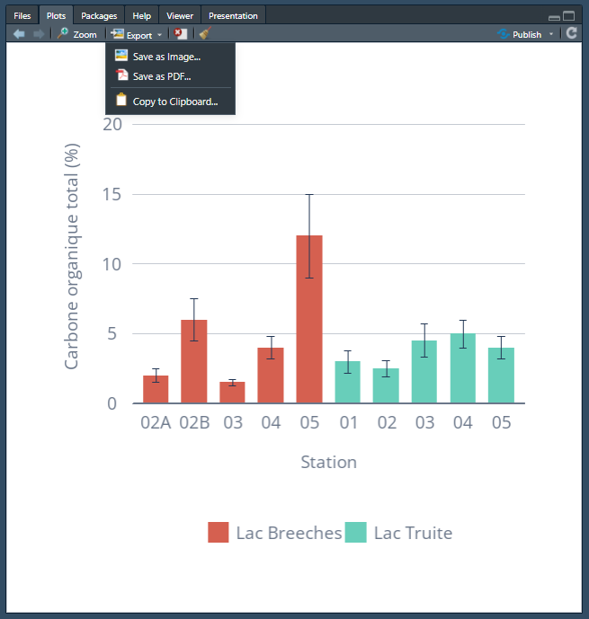

# Annexe : Exemples REPREX

## Exemple 1 : Diagramme à bandes exactement comme design.ca

Voici un exemple de REPREX qui montre comment structurer un graphique en barres en suivant les bonnes pratiques de présentation.

```{r include=FALSE}
# Lire le fichier R contenant le code REPREX
knitr::read_chunk("reprex/marche_navigateurs_geom_bar.R")
knitr::read_chunk("reprex/graph_olivier1.R")

```

```{r marche-navigateurs, echo=TRUE, message=FALSE, warning=FALSE}
```

## Exemple 2 : Diagramme à bandes pour rapport gouvernemental

```{r graph-olivier1, echo=TRUE, eval=FALSE}
```



### Exporter un graphique depuis le volet `Plots` dans RStudio

Pour exporter un graphique affiché dans le volet **`Plots`** de RStudio, suivez ces étapes :

1.  **Créer votre graphique** : Exécutez votre code pour afficher le graphique dans le volet **`Plots`**.

2.  **Exporter le graphique** :

    -   **Sauvegarder comme image** :

        -   Cliquez sur le bouton **`Export`** en haut à droite du volet **`Plots`**.

        -   Sélectionnez **`Save As Image`**.

        -   Choisissez le format (PNG, JPEG, etc.), le nom de fichier, la résolution (DPI), et l'emplacement de sauvegarde.

        -   Cliquez sur **`Save`** pour enregistrer l'image.

    -   **Copier dans le presse-papier** :

        -   Cliquez sur **`Export`**.

        -   Sélectionnez **`Copy to Clipboard`**.

        -   Collez ensuite le graphique directement dans un document (Word, PowerPoint, etc.) en utilisant la commande de collage (Ctrl + V).

    

### Note

Il n'existe pas de commande R pour reproduire exactement ces actions manuelles. Toutefois, vous pouvez utiliser la fonction `ggsave()` pour automatiser l'enregistrement d'un graphique dans un script, mais cela n'offre pas les options visuelles du volet **`Plots`**.
