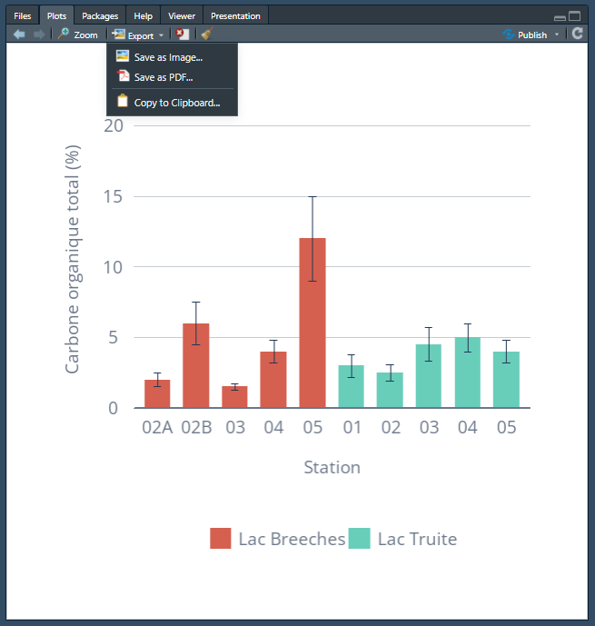
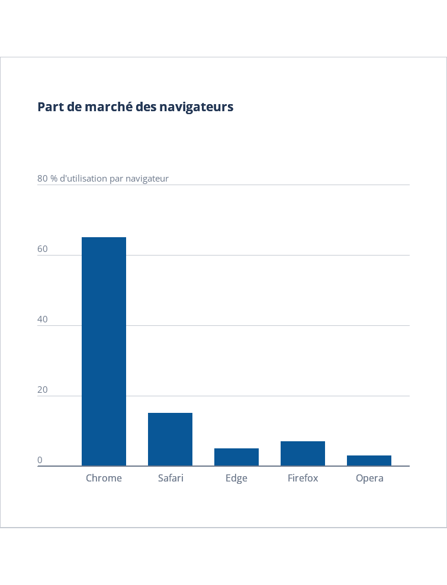
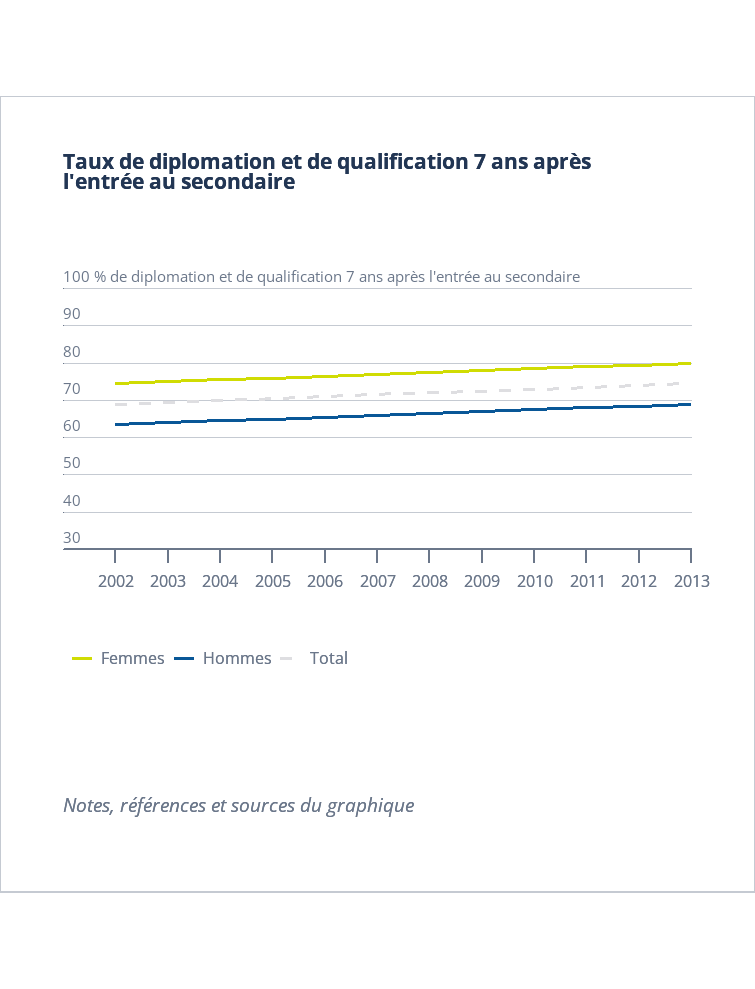
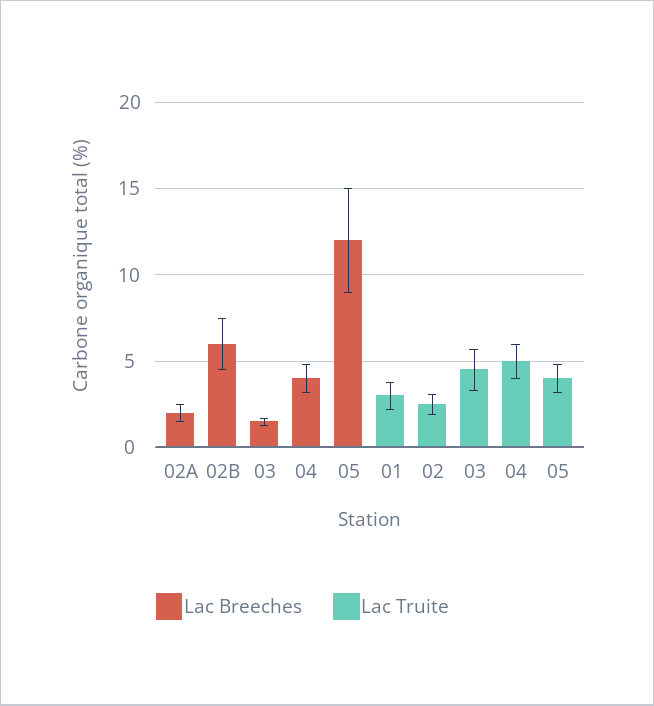
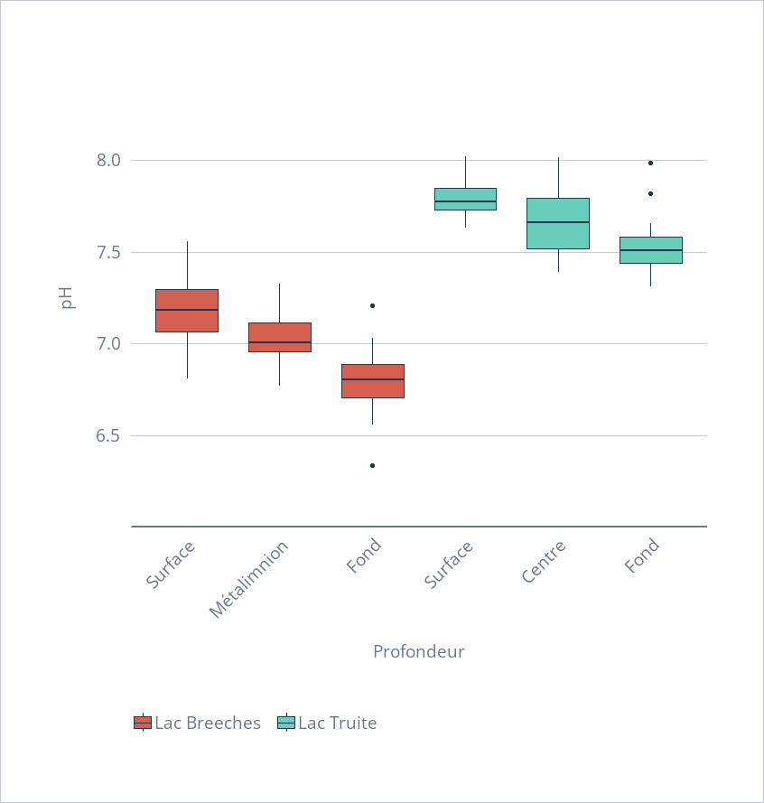
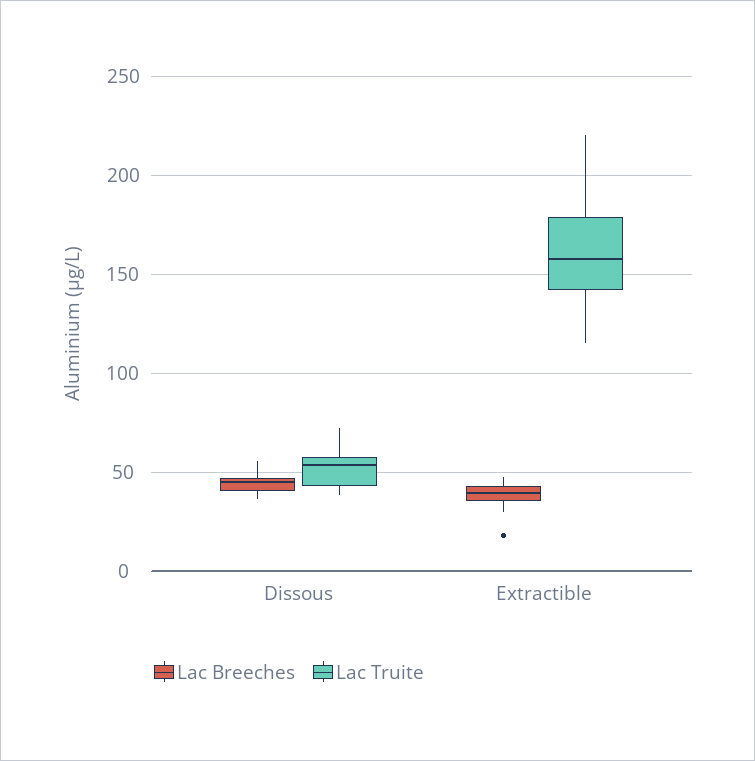
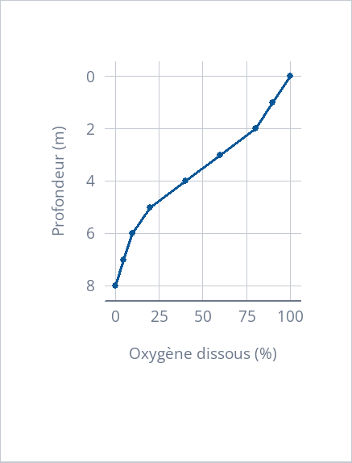

# Annexe : Exemples REPREX

## Exporter un graphique depuis le volet `Plots` dans RStudio

Pour exporter un graphique affiché dans le volet **`Plots`** de RStudio, suivez ces étapes :

1.  **Créer votre graphique** : Exécutez votre code pour afficher le graphique dans le volet **`Plots`**.

2.  **Exporter le graphique** :

    -   **Sauvegarder comme image** :

        -   Cliquez sur le bouton **`Export`** en haut à droite du volet **`Plots`**.

        -   Sélectionnez **`Save As Image`**.

        -   Choisissez le format (PNG, JPEG, etc.), le nom de fichier, la résolution (DPI), et l'emplacement de sauvegarde.

        -   Cliquez sur **`Save`** pour enregistrer l'image.

    -   **Copier dans le presse-papier** :

        -   Cliquez sur **`Export`**.

        -   Sélectionnez **`Copy to Clipboard`**.

        -   Collez ensuite le graphique directement dans un document (Word, PowerPoint, etc.) en utilisant la commande de collage (Ctrl + V).

    

**NB. Il n'existe pas de commande R pour reproduire exactement ces actions manuelles. Toutefois, vous pouvez utiliser la fonction `ggsave()` pour automatiser l'enregistrement d'un graphique dans un script, mais cela n'offre pas les options visuelles du volet `Plots`.**

## Comme design.ca

### Diagramme à bandes 

Voici des exemples reproductibles qui montrent comment structurer divers graphiques en suivant à la lettre des normes de quebec.ca. 

```{r include=FALSE}
# Lire le fichier R contenant le code REPREX
knitr::read_chunk("reprex/marche_navigateurs_geom_bar.R")
knitr::read_chunk("reprex/graphique_lineaire_simple.R")
knitr::read_chunk("reprex/graph_olivier1.R")
knitr::read_chunk("reprex/graph_olivier2.R")
knitr::read_chunk("reprex/graph_olivier3.R")
knitr::read_chunk("reprex/profil_vertical.R")

```

```{r marche-navigateurs, echo=TRUE, message=FALSE, warning=FALSE, eval=FALSE}
```



### Diagramme linéraire 

```{r graph-lineaire-simple, echo=TRUE, message=FALSE, warning=FALSE, eval=FALSE}
```



## Pour rapport gouvernemental

Voici maintenant des exemples reproductibles qui montrent comment structurer divers graphiques en ayant des normes de présentation cohérentes avec l'identité visuelle du gouvernement, tout en étant utilisable sur R de manière intuitive. 

### Diagramme à bandes

```{r graph-olivier1, echo=TRUE, eval=FALSE}
```



### Diagramme à moustaches

```{r graph-olivier2, echo=TRUE, eval=FALSE}
```



```{r graph-olivier3, echo=TRUE, eval=FALSE}
```


### Diagramme linéaire

```{r profil-vertical, echo=TRUE, eval=FALSE}
```

